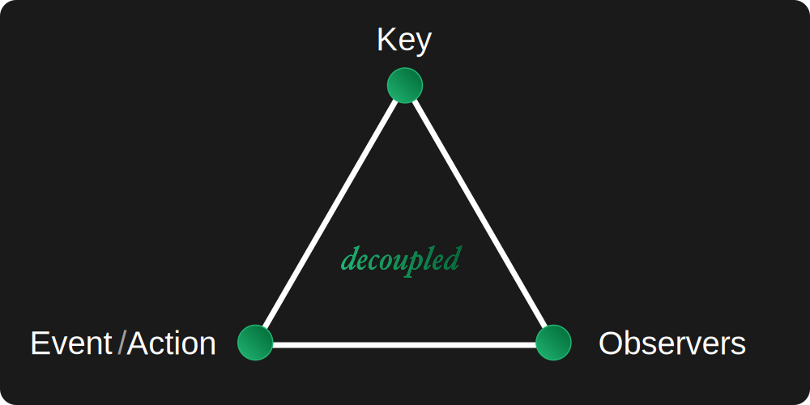

<a href="https://rubygems.org/gems/observers" title="Install gem"></a>

# Observers

Observe objects/keys of any kind and trigger actions and events on them.

<p align="center"></p>

Observers are decoupled from the objects they observe. Instead of directly observing a particular object, they observe a *key* that represents that object. Anything can be observed out of the box; a class, instance, struct, symbol or string... you just need to `observe` it:

```ruby
class MySubscriber
  include Observers
  observe MyPublisher

  def self.handle
    # This method will be called upon trigger.
  end
end
```

Add observers from the object being observed with:
```ruby
class MyPublisher
  include Observers
  observers << MySubscriber
end
```

ℹ️ Observers are ordered, called in the order that they are defined and can be reordered via an array-like interface.

## Triggers

### Actions

Call the `my_action` method on all observers of `MyPublisher` with:
```ruby
class MyPublisher
  include Observers
  trigger action: :my_action
end
```

### Events

Trigger events on observers with the `event` keyword argument:
```ruby
class MyPublisher
  include Observers
  trigger action: :my_action, event: MyEvent.new(my_data)
end
```

ℹ️ All observers to `MyPublisher` will have their `my_action(event:)` method called with the event passed in as a keyword argument.

### Keys

Call actions on all observers of a differeent object/key with a `key:` keyword argument:
```ruby
trigger key: OtherPublisher, action: :my_action
trigger key: OtherPublisher, action: :my_action
trigger key: OtherPublisher, action: :my_action, event: MyEvent.new(event_data)
```

## Integrations

## LowEvent

Observers integrates with [LowEvent](https://github.com/low-rb/low_event) for a more event-centric API.

Inherit you event class from `LowEvent`:

```ruby
class MyEvent < LowEvent
  def initialize(data:, action: :render)
    super(key: self.class, action:)
    @data = data
  end
end
```

Observe it with:
```ruby
class MyObserver
  include Observers
  observe MyEvent

  def render(event:)
    event.data
  end
end
```

Trigger the event and its observer with:
```ruby
MyEvent.trigger(data: "Rendered") # => "Rendered"
```

ℹ️ Events define their own actions.

## API

### Default Action

The default action that will be called on an observer is `handle`/`handle(event:)`. This happens when the trigger's, event's or observer's `action` are `nil`.

### Overriding Actions

An action can be overridden at each layer:
1. On the `trigger` method by including an `action:` keyword argument
2. On the event by populating its `action` attribute
3. On the observer by configuring an `action:` on `observe`:
```ruby
class MySubscriber
  include Observers

  observe MyPublisher, action: :clear_cache

  def self.clear_cache
    # The `clear_cache` method will be called regardless of the trigger's action/event's action.
  end
end
```

### Action Precedence

1. `observe action:` and `observers << my_object, action:` - Overrides `trigger` and event actions
2. `trigger action:` - Overrides event actions
3. Event's `@action` - Overrides the default action of each observer

### Observers

The `observers` method is more flexible than it seems.

Reference an object other than `self` to observe:
```ruby
observers(my_object) << my_observer
```

Override the default action of the observer with:
```ruby
observers.push(my_observer, action: :overridden_action)
```

ℹ️ **Note:** `push` needs to be used instead of `<<` in this situation so that Ruby doesn't get confused about the syntax.

### Actions

- `trigger` - Calls all observers. Returns the last non-nil value.
- `take` - Calls all observers up until the first non-nil value. Returns the first non-nil value.

## Config

Copy and paste the following and change the defaults to configure Observers:

```ruby
# This configuration should be set before the class that includes Observers is required.
Observers.configure do |config|
  # A lambda to call when actions/events are triggered for a key without observers.
  config.key_callback = nil # Or "->(key) { MyLogger.log('my message') }"
end
```

## Installation

Add `gem 'observers'` to your Gemfile then:
```
bundle install
```
